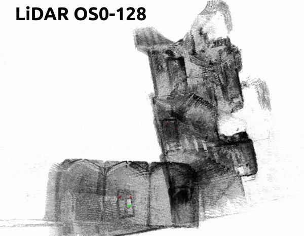

<h1>Photometric SLAM and Bundle Adjustment for RGB-D and LiDAR</h1>

<p> 
The joint optimization of the sensor trajectory and 3D map is a crucial characteristic of Simultaneous Localization and Mapping (SLAM) systems. Modern 3D LiDARs now retain higher resolutions that enable the creation of point cloud images resembling those taken by conventional cameras. Nevertheless, the typical effective global refinement techniques employed for RGB-D sensors are not widely applied to LiDARs. This repo includes SLAM/BA photometric strategies that accounts for both RGB-D and LiDAR in the same way. Being purely photometric our approaches are completely free from data association.
</p>

<p>In this repo, we provide an <b>updated</b> version of <a href="https://github.com/digiamm/md_slam">MD-SLAM</a> (around 30Hz for RGBD and 50Hz for LiDAR) and our <b>new photometric BA</b> refinement.</p>

<h2>Data download</h2>

[Download](https://drive.google.com/drive/folders/1tq3R881MS7IyD-w7f3jbKUzlxDZzV1u7?usp=sharing) our pre-processed data. This trial data contains: [Newer College Dataset](https://ori-drs.github.io/newer-college-dataset), [ETH3D](https://www.eth3d.net/slam_datasets) and some self-recorded one. 

<h2>Docker</h2>

Before you locally install anything, bear in mind that you can use our <b>[docker](https://github.com/digiamm/ba_md_slam/blob/main/docker/README.md)</b>.


<h2>Installation</h2>

If you don't want to use our <b>[docker](https://github.com/digiamm/ba_md_slam/blob/main/docker/README.md)</b>, proceed [here](https://github.com/digiamm/ba_md_slam/blob/main/installation/README.md) - good luck! The current implementation was tested on CUDA 11.2.

<h2>CPU only version</h2>

For a CUDA free version you can checkout to the branch `cpu`, however we don't plan to mantain it.

<h1>MD-SLAM Multi-cue Direct SLAM</h1>

<p align="center">
  
   
</p>

<h2 name=run>Run MD-SLAM</h2>

Run the pipeline
```
rosrun md_slam slam -i path/to/dataset -c path/to/configuration/file
```
Basic configuration files can be found in `configs/`. Here we provide some basic configurations, for other datasets we suggest to use "standard configurations", i.e. `standard_os0128_configuration.json`.

Other flags can be enabled when running MD-SLAM, such as enable viewer, save data at the end of the run, verbose, etc. The full list of any executables in the package can be see with `-h` flag. For `md_slam` this is the full list:

```
config file to load
-c (--config), default: []

if set enables viewer, otherwise just runs
-e (--enable-viewer), default: [not-set]

displays this help message
-h (--help), default: [not-set]

input bag file to start
-i (--input), default: []

output filename for graph and pyramid serialization
-o (--ouput), default: []

if set enables perspective view, i.e. gl camera follows sensor
-p (--perspective), default: [not-set]

if set enables cerr and cout streams
-v (--verbose), default: [not-set]
```

<h1>Photometric Bundle Adjustment</h1>

<p align="center">
  
   
</p>

Refine the MD-SLAM estimate, or any other initial guess
```
rosrun md_slam ba -i path/to/dataset -o path/to/output -s <lidar/rgbd>
```
Our algorithm has just few parameters and we provide basic configuration that slightly differ for each sensor (RGB-D, LiDAR), this can be accessed through the `-s` flag. Other flags can be enabled when running our BA, such as enable viewer during optimization, etc. The full list can be accessed always using `-h`. 

The BA executable expects the input graph and clouds in binary format named `.boss`. You can initially try this using the initial guess of MD-SLAM (you can output the graph `-o` flag). We use our custom format because is 100x faster compared to PCL serialization system. We provide some sample data to straight run BA [here](https://drive.google.com/drive/folders/1tq3R881MS7IyD-w7f3jbKUzlxDZzV1u7?usp=sharing).  

<h1>Utils</h1>

<h3>View data</h3>

If you run MD-SLAM and BA with `-o` you can save the graph and the point clouds attached to it. If you want to see the output data is enough to run
```
rosrun md_slam show_graph -i path/to/output/file
```
Once you are in the viewer you can access to some custom viz using the `h` key.

<h3>Evaluate data</h3>

The file generated from the pipeline containing the graph, can be converted in [TUM](https://vision.in.tum.de/data/datasets/rgbd-dataset/file_formats) groundtruth format
```
timestamp tx ty tz qx qy qz qw
``` 
by running the following
```
rosrun md_slam graph_converter -i path/to/graph/file -o path/to/tum/trajectory/file
```

<h2>Use your data with MD-SLAM</h2>

Our is a purely direct and symmetric pipeline that works independently for RGB-D and LiDAR (the only thing that changes is the projection). For this reason, for both the sensors, the rosbag must have a `camera matrix`, a `grayscale` (or intensity) and a `depth` (or range) images syncronized. Therefore the number of these messages needs to be the same. For instance, an output of `rosbag info` of your newly created rosbag needs to be like this:
```
topics:      /os/camera_info        1190 msgs    : sensor_msgs/CameraInfo
             /os/image_depth        1190 msgs    : sensor_msgs/Image     
             /os/image_intensity    1190 msgs    : sensor_msgs/Image
```
<h3>Camera matrix</h3>

<b>RGB-D</b> camera matrix contains `fx, fy, cx, cy`, focal lenghts and principal points are estimated after intrinsics calibration and usually come with the dataset. 
```
K: [fx, 0, cx, 0, fy, cy, 0, 0, 1]
```
<b>LiDAR</b> camera matrix similiarly is parameterized by azimuth and elevation resolution. These are calculated as `azimuth_resolution = (h_fov_max - h_fov_min)/img_cols` and `elevation_resolution = (v_fov_max - v_fov_min)/img_rows`.
```
K: [-1 / azimuth_resolution, 0, img_cols / 2, 0, -1 / elevation_resolution, img_rows / 2, 0, 0, 1]
```
For instance, for an OS0-128 with `v_fov_max = pi/4`, `v_fov_min = -pi/4` with `img_rows = 128` and having the complete encoder rotation of 360deg so `h_fov_max = 2pi`, `h_fov_min = 0` with `img_cols = 1024` we will have the following results on the camera matrix:
```
K: [-162.9746551513672, 0.0, 512.0, 0.0, -79.22404479980469, 64.0, 0.0, 0.0, 1.0]
```
<h3>Input cues - images</h3>

<b>RGB-D</b> data usually already comes with grayscale and depth images already "syncronized". For <b>LiDAR</b> one can generate both intensity and range images from the point cloud by just using a spherical projection (look at the [paper](https://arxiv.org/abs/2203.13237) for more info).  
<h2> Process your data with our utilities </h2>   

<h3>RGB-D</h3>

For RGB-D we provide the executable to convert [ETH3D](https://www.eth3d.net/slam_datasets) (ex TUM format - [more details](https://vision.in.tum.de/data/datasets/rgbd-dataset)) into a rosbag processable by our pipepline. Once you have sourced the workspace
```
source ~/catkin_ws/devel/setup.bash
```
Run
```
rosrun md_slam eth_dataset_manipulator -i associated.txt -k calibration.txt -o md_slam_output.bag
``` 
<h3>LiDAR</h3>

For LiDAR we provide the executable to convert [Newer College Dataset](https://ori-drs.github.io/newer-college-dataset) rosbag into a rosbag processable by our pipeline. Once you have sourced the workspace
```
source ~/catkin_ws/devel/setup.bash
```
Run 
```
rosrun md_slam ncd_manipulator -j
```
This will generate a configuration file `lidar_configuration.json` that you can easily edit based on the LiDAR used. Make sure you add the name of the LiDAR topic used on the configuration file! Once this is done, run
```
rosrun md_slam ncd_manipulator -c lidar_configuration.json -o md_slam_output.bag input.bag
```
If you want to stick together multiple input rosbags into one then you can simply add them at the end of the command (make sure timestamps are consecutives), like
```
rosrun md_slam ncd_manipulator -c lidar_configuration.json -o md_slam_output.bag input1.bag input2.bag ...
```
NOTE: this can be used to process any LiDAR rosbag but we only tested on [Newer College Dataset](https://ori-drs.github.io/newer-college-dataset) data. 

<h2>Use your data with BA</h2>

Once you have a rosbag in MD-SLAM format and you have a trajectory file in TUM format you can use our utility to generate an input for BA. This is helpful, if you want to try data starting from different trajectories (SLAM/GNSS). 

```
rosrun md_slam trajrosbagcloud2srrg -j
```

Generate a config file and modify this according to your specifics. After you can process your data

```
rosrun md_slam trajrosbagcloud2srrg -c config/previously/generated -dr downsampling/rot -dt downsamling/trans -traj input/trajectory/tum input/rosbag
```

Note that `dr` and `dt` are useful if the trajectory frequency input is very high, hence it may be required to be downsampled (otherwise it may not fit to GPU)

<h2>Other utilies</h2>

We provide other utilities to convert cloud to pcl format, to color point clouds using RGB channel, etc. All the required parameters for each executable can be retrieved using `-h` flag. 

<h2>Difference from the papers</h2>

The open-source version of the code has undergone significant refactoring compared to the version used for generating the results mentioned in the papers. Numerous new features have been incorporated, and numerous fixes have been implemented. As a result, it is not anticipated that the code will reproduce the exact results presented in the paper. Nonetheless, the outcomes should be similar. Our intention is to continue maintaining and enhancing this repository in the future.

<h2>Papers</h2>

If you use any of this code please cite our works:

```
@article{di2023photometric,
  title={Photometric LiDAR and RGB-D Bundle Adjustment},
  author={Di Giammarino, Luca and Giacomini, Emanuele and Brizi, Leonardo and Salem, Omar and Grisetti, Giorgio},
  journal={IEEE Robotics and Automation Letters (RA-L)},
  year={2023},
  publisher={IEEE}
}
```

```
@inproceedings{di2022md,
  title={MD-SLAM: Multi-cue Direct SLAM},
  author={Di Giammarino, Luca and Brizi, Leonardo and Guadagnino, Tiziano and Stachniss, Cyrill and Grisetti, Giorgio},
  booktitle={2022 IEEE/RSJ International Conference on Intelligent Robots and Systems (IROS)},
  pages={11047--11054},
  year={2022},
  organization={IEEE}
}
```

